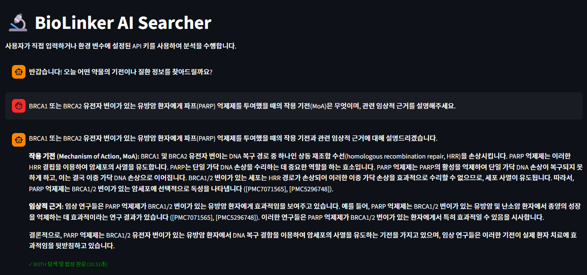
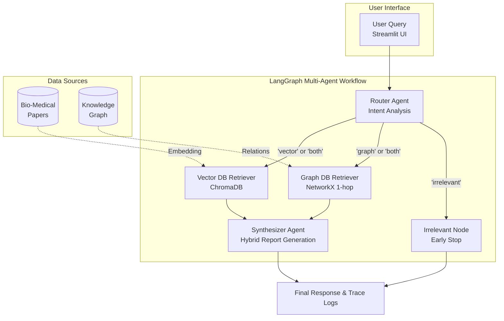
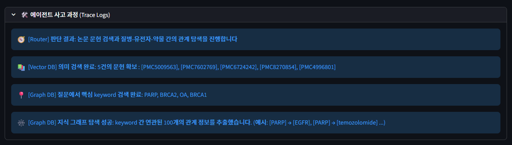
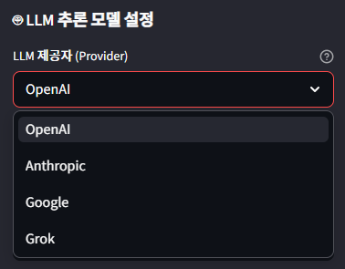
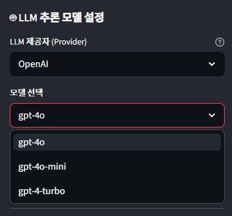
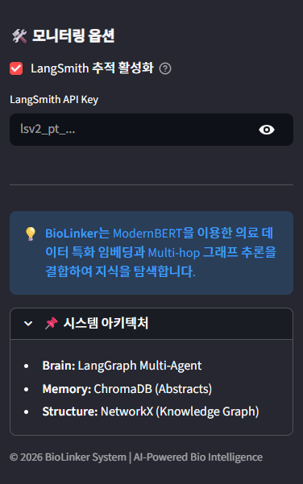

# 🧬 BioLinker: AI-Powered Bio-Medical RAG System




**BioLinker**는 제약 R&D 임상이행 및 신약 개발 연구원들을 위해 설계된 **도메인 특화 하이브리드 RAG(Retrieval-Augmented Generation) 시스템**입니다.
의학 논문 텍스트 기반의 **Vector 검색**과 약물-표적-질환의 인과관계(MoA)를 파악하는 **Knowledge Graph 탐색**을 LangGraph 기반의 멀티 에이전트 워크플로우로 결합하여, 환각(Hallucination)이 없는 논리적이고 신뢰할 수 있는 임상 리포트를 실시간으로 제공합니다.

---

## 🧠 1. Architecture (아키텍처 소개)

본 프로젝트는 단순한 문맥 검색을 넘어서, 사용자의 질문 의도를 스스로 파악하고 데이터베이스를 선택적으로 탐색하는 **Multi-Agent Orchestration** 구조로 설계되었습니다.

### 💡 Core Components & Logic

* **의도 필터링 (Router Agent):** 사용자의 질의가 논문 검색이 필요한지, 기전(MoA) 탐색이 필요한지 판단합니다. 일상적인 대화나 의학과 무관한 질문, 가상의 물질에 대해서는 안전하게 거절(Safe Refusal)하여 불필요한 토큰 낭비와 환각을 방지합니다.

* **Vector Retriever (ChromaDB + ModernBERT):** 의료 도메인에 특화된 `ModernBERT` 임베딩 모델을 사용하여 17,000여 건의 논문 초록(Abstract) 중 질의와 의미론적으로 가장 유사한 문헌을 추출합니다.

* **Graph Retriever (NetworkX):** 질문에서 질병, 약물 등의 핵심 개체(Entity)를 직관적으로 매칭하고, 그래프 상에 연결된 1-hop(직접 연관 관계) 엣지들을 추출하여 A -> B 형태의 인과관계를 찾아냅니다.

* **Report Synthesizer:** 추출된 두 가지 이기종(Text + Graph) 데이터를 융합하여 임상 리포트를 작성합니다. 이때 참조한 논문의 제목과 ID를 강제로 인용하도록 프롬프팅되어 XAI(설명 가능한 AI)의 신뢰성을 확보합니다.

### 📊 Model Flow Diagram



### 파이프라인 구성 요소 상세 설명

* **[ 🌐 User Interface ]**

    **User Query (Streamlit UI)**: 사용자가 자연어로 질문을 입력하고, 최종 생성된 임상 리포트와 에이전트의 내부 추론 경로(Trace Logs)를 시각적으로 확인할 수 있는 대화형 웹 인터페이스입니다.

* **[ 🧠 LangGraph Multi-Agent Workflow ]**

    **Router Agent (의도 분석)**: LLM을 활용해 사용자 질문의 핵심 의도를 분석합니다. 문헌 검색(Vector), 기전 탐색(Graph), 복합 탐색(Both), 혹은 무관한 질문(Irrelevant)인지 판단하여 최적의 데이터베이스 탐색 경로로 분기합니다.

    **Vector DB Retriever (논문 검색)**: 의학 도메인에 특화된 `ModernBERT` 임베딩을 통해, 질문과 의미론적으로 가장 유사한 논문 초록(Abstract) 데이터를 로컬 ChromaDB에서 고속으로 추출합니다.

    **Graph DB Retriever (기전 탐색)**: 질문 텍스트 내에 포함된 핵심 개체(약물, 질병, 유전자 등)를 지식 그래프(NetworkX)의 노드와 직관적으로 매칭하고, 직접 연결된 1-hop 엣지를 추출하여 명시적인 인과관계(MoA)를 파악합니다.

    **Irrelevant Node (조기 종료)**: 의학 및 제약 R&D와 무관한 일상적인 질문이거나 데이터베이스 범위를 벗어난 가상 물질에 대한 질문을 차단하여, 불필요한 토큰 낭비 없이 안전하게 답변을 거절(Safe Refusal)합니다.

    **Synthesizer Agent (최종 리포트 합성)**: Vector DB의 문헌 컨텍스트와 Graph DB의 관계망 데이터를 종합합니다. 프롬프트 엔지니어링을 통해 외부 지식 개입을 엄격히 차단하고, 참조한 논문의 제목과 출처 ID를 강제로 인용하여 환각(Hallucination) 없는 논리적인 최종 임상 리포트를 생성합니다.

* **[ 🗄️ Data Sources ]**

    **Bio-Medical Papers & Knowledge Graph:** AI-Hub의 전문 라벨링 데이터셋을 기반으로 파싱된 로컬 데이터베이스입니다. 논문 텍스트는 임베딩되어 Vector DB로, 개체 간 상호작용은 엣지(Edge)로 매핑되어 Graph DB로 활용됩니다.

#### ⚙️ 에이전트 사고 과정 (Trace Logs) 시각화
BioLinker는 모델이 답변을 도출하기까지 거친 데이터베이스 탐색 경로와 확보된 근거 데이터를 투명하게 공개하여 신뢰성을 제공합니다.



---

## 📦 2. Data Setup (데이터셋 세팅 안내)

본 프로젝트는 AI-Hub(한국지능정보사회진흥원)에서 제공하는 전문 라벨링 데이터인 **[바이오·의료 논문 간 연계분석 데이터](https://aihub.or.kr/aihubdata/data/view.do?currMenu=115&topMenu=100&dataSetSn=71369)**를 활용합니다.

### 🚨 저작권 및 데이터 무단 배포 금지 안내

대한민국 저작권법 및 AI-Hub 이용약관에 따라 본 저장소에는 원본 학습 데이터가 포함되어 있지 않습니다. 프로젝트를 로컬에서 직접 빌드하시려면 아래 절차에 따라 개별적으로 데이터를 다운로드해 주십시오.

1. AI-Hub에서 위 링크의 데이터를 다운로드합니다.

2. 다운로드한 데이터 중 **`02.라벨링데이터`** 폴더 내 Training set ZIP 파일을 프로젝트의 `data/` 경로 하위에 배치해 주세요. 원천데이터(01)는 사용하지 않습니다.

```text
BioLinker_Project/
├── data/            
│   ├── 02.라벨링데이터/              
│   │   ├── TL_Breast cancer(유방암).zip
│   │   ├── TL_Colorectal cancer(대장암).zip
│   │   └── ... (총 5개+ ZIP 파일)
```

---

## 3. 📂 Project Structure (디렉토리 구조)

```text
BioLinker_Project           # 📦 배포용 최상위 루트 폴더
│
├── app/                    # 🌐 1. Frontend & Backend
│   ├── main.py             # Streamlit 메인 UI (채팅 및 로그 모니터링)
│   ├── sidebar.py          # UI 사이드바 (동적 LLM 선택, API Key 보안 입력)
│   └── api.py              # FastAPI 백엔드 서버 (LangGraph 실행 진입점)
│
├── biolinker/              # 🧠 2. Core AI Modules
│   ├── agents.py           # 라우터, 검색, 합성 등 개별 LLM 에이전트 클래스
│   ├── workflow.py         # 에이전트들을 엮는 LangGraph StateGraph 파이프라인
│   ├── database.py         # ChromaDB 및 NetworkX 로드 및 매니징
│   ├── data_parser.py      # AI-Hub JSON 파싱 및 정제 (CSV 변환)
│   └── config.py           # 시스템 전역 프롬프트 및 경로 설정
│
├── scripts/                # 🛠️ 3. Execution Scripts
│   ├── build_index.py      # 파싱된 데이터 기반 Vector / Graph DB 인덱싱
│   └── evaluate.py         # Ragas 프레임워크 기반 하이브리드 RAG 정량 평가 스크립트
│
├── data/                   # 📁 4. Local Database & Logs (Git Ignore 대상)
│   ├── chroma_db/          # 로컬 임베딩 벡터 저장소
│   ├── processed/          # 정제된 문헌 및 관계 데이터셋 (.csv)
│   ├── chat_history.json   # 프론트엔드 채팅 로그
│   └── knowledge_graph.gml # NetworkX 로컬 그래프 구조 파일
│
├── run.py                  # 🚪 5. 사용자 CLI 진입점 (모든 명령 통합)
├── Dockerfile              # 🐳 6. 환경 격리용 도커 설정 파일
├── requirements.txt        # 📚 7. 의존성 패키지 명세서
└── .env                    # 🔑 8. 환경변수 (API Key 보관용, 수동 생성 필요)
```

---

## 🚀 4. Quick Start (설치 및 시작 가이드)

### Option A: Local Python Environment (가상환경)

최신 고속 패키지 매니저인 `uv` 사용을 권장합니다.

```bash
# 1. 저장소 클론 (Clone Repository)
git clone [https://github.com/cudaboy/BioLinker_Project.git](https://github.com/cudaboy/BioLinker_Project.git)
cd BioLinker_Project

# 2. 가상환경 생성 및 활성화
python3 -m venv venv
source venv/bin/activate  # Windows: venv\Scripts\activate

# 3. 필수 라이브러리 초고속 설치 (uv 활용)
pip install uv
uv pip install --no-cache -r requirements.txt --index-strategy unsafe-best-match
```

### Option B: Docker Container

의존성 충돌 없이 완벽하게 격리된 환경에서 실행하려면 Docker를 사용하세요.

```bash
# 1. 도커 이미지 빌드
docker build -t biolinker-app .

# 2. 도커 컨테이너 실행 (볼륨 마운트를 통해 로컬 DB 유지)
docker run -d -p 8000:8000 -p 8501:8501 -v $(pwd)/data:/app/data biolinker-app --start
```

---

## 5. Supported Modes (명령어 사용법)

모든 작업은 중앙 진입점인 `run.py`를 통해 터미널 명령어 한 줄로 실행할 수 있습니다.
초기 세팅 시 **반드시 `--build`를 먼저 실행하여 데이터를 구축한 후 `--start`로 서버를 구동**해야 합니다.

### 🏗️ Phase 1: Data Parsing & DB Indexing (`--build`)

AI-Hub의 RAW 데이터를 파싱하고, BioClinical-ModernBERT를 이용해 Vector DB 및 Graph DB를 자동으로 한 번에 구축합니다. (초기 1회 필수 실행, 데이터 크기에 따라 10~15분 소요)

```bash
python run.py --build
```

### 🌐 Phase 2: Full-Stack Start (`--start`)

FastAPI 백엔드 API와 Streamlit 프론트엔드 UI를 병렬 프로세스로 동시 실행하여 즉시 사용 가능한 풀스택 환경을 제공합니다.
실행 후 `http://localhost:8501`로 접속하여 UI를 사용할 수 있습니다.

```bash
python run.py --start
```




*(사용자 인터페이스 사이드바에서 추론을 담당할 LLM 제공자와 모델을 동적으로 변경할 수 있습니다.)*



*(LangSmith 추적 활성화를 통해 백엔드 에이전트의 작동 과정을 세밀하게 모니터링할 수 있습니다.)*

### 🔬 Phase 3: RAG Evaluation (`--eval`)

Ragas 프레임워크와 `LLM-as-a-Judge` 방식을 활용하여, 구축된 하이브리드 RAG 시스템의 신뢰도(Faithfulness)와 사실 부합성 등을 정량적으로 자동 평가하고 리포팅합니다.

```bash
python run.py --eval
```

### ⚙️ Phase 4: API & UI Standalone (`--api` / `--ui`)

개발 및 디버깅을 위해 백엔드 서버나 프론트엔드 대시보드를 개별적으로 구동할 수 있는 옵션입니다.

```bash
# FastAPI 백엔드 서버만 단독 실행 (포트 8000)
python run.py --api

# Streamlit 프론트엔드 UI만 단독 실행 (포트 8501)
python run.py --ui
```

---

## 📄 6. License (라이선스)

이 프로젝트는 Apache License 2.0을 따릅니다.
상업적 이용, 수정, 배포가 자유롭게 허용되며, 상세한 내용은 저장소 내 `LICENSE` 파일을 참조하시기 바랍니다.

Note: 프로젝트에 사용된 알고리즘과 시스템 아키텍처에 대한 라이선스이며, 모델의 정보 검색 대상이 되는 **AI-Hub 원본 데이터셋은 별도의 엄격한 약관이 적용**됩니다. 데이터는 AI-Hub 이용약관 및 대한민국 저작권법에 의해 보호받고 있으므로 직접 AI-Hub를 통해 다운로드하여 이용하셔야 합니다.