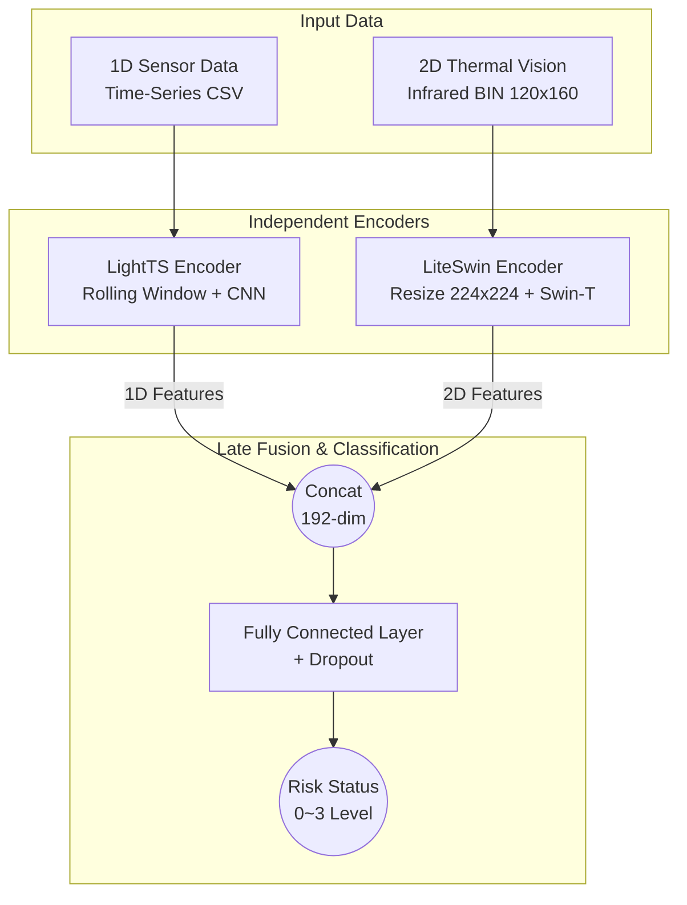

# 🏭 CLiST: Cross-modal Late-fusion integrated Sensor & Thermal network


**CLiST**는 스마트 제조현장의 이송장치(AGV/OHT)에서 발생하는 탄화 현상을 사전에 예측하고 방지하기 위해 개발된 **멀티모달 예지보전 AI 모델**입니다. 1D 시계열 센서 데이터와 2D 열화상 이미지를 결합하여 장비의 위험도를 4단계(Normal, Attention, Warning, Danger)로 실시간 분류합니다.

---

## 🧠 1. Architecture (아키텍처 소개)

본 프로젝트의 핵심 모델인 **CLiST**는 멀티모달 지연 융합(Late-Fusion) 아키텍처를 다룬 선행연구 논문의 아이디어를 기반으로, 실제 스마트 제조 현장의 이송장치 데이터 특성에 맞게 직접 설계하고 PyTorch로 구현(Implementation)한 모델입니다.

* 📄 **Reference Paper:** [A Multimodal Time-Frequency Fusion Architecture for Fault Diagnosis in Rotating Machinery](https://www.mdpi.com/2076-3417/16/7/3269)

### 💡 Paper Concept vs. My Implementation

**1. 논문에서 제안한 핵심 구조 (The Original Concept)**

해당 논문에서는 시스템의 상태를 정확히 진단하기 위해 서로 다른 형태의 데이터(예: 1D 센서 시계열 데이터와 2D 비전 데이터)를 각각 독립적인 인코더로 학습시킨 후, 최종 분류 레이어 직전에서 결합하는 **지연 융합(Late Fusion)** 방식을 제안했습니다. 이 구조는 각 데이터 모달리티의 고유한 공간적/시간적 특성 손실을 막고 예측의 정확도를 극대화하는 장점이 있습니다.

**2. 본 프로젝트의 구현 방식 (My Implementation)**

본 프로젝트(CLiST)는 위 논문의 구조적 철학을 차용하되, '제조 현장의 실시간 예지보전'이라는 특수한 목적에 맞추어 다음과 같이 독자적인 모델 파이프라인을 구축했습니다.

* **1D Sensor Stream (LightTS Encoder):** 센서 데이터의 트렌드(mean, std)를 추출하기 위해 결측치 보간 및 Rolling Window 기법을 적용한 후, 경량화된 1D-CNN을 통해 시계열 특징을 인코딩합니다.

* **2D Vision Stream (LiteSwin Encoder):** 열화상 이미지의 공간적 열 분포 패턴을 효과적으로 포착하기 위해 최신 비전 아키텍처인 Swin Transformer 기반의 인코더를 적용했습니다.

* **Fusion & Classification:** 두 스트림에서 추출된 특징 벡터를 Concat 연산으로 결합하고, 위험/경고 데이터의 불균형(Class Imbalance) 문제를 완화하기 위해 Dropout이 포함된 분류기(Classifier)를 통과시켜 최종 4단계 위험도(Normal ~ Danger)를 산출합니다.

### 📊 Model Flow Diagram


- 1D Sensor Stream: 센서 데이터의 결측치를 보간하고 롤링 윈도우(Rolling Window)를 적용하여 시계열 트렌드(mean, std)를 추출합니다.

- 2D Vision Stream: 224x224로 리사이즈된 열화상 데이터를 Swin Transformer 기반 인코더에 통과시켜 공간적 열 분포 패턴을 추출합니다.

- Late Fusion: 두 인코더에서 나온 특징 벡터를 결합(Concatenation)하고, Dropout이 적용된 분류기를 통해 최종 위험도를 예측합니다.

---

## 📦 2. Data Setup (데이터셋 세팅 안내)

본 프로젝트는 AI-Hub(한국지능정보사회진흥원)에서 제공하는 '**제조현장 이송장치의 열화 예지보전 멀티모달 데이터**'를 활용합니다.

### 📊 데이터 구성 (1D & 2D Modality)
장비의 탄화 및 열화 상태를 다각도로 진단하기 위해 다음과 같은 두 가지 이기종(Heterogeneous) 데이터를 사용합니다.

* **1D Sensor Data (`.csv`)**: 이송장치(AGV/OHT) 구동 중 발생하는 **시계열 센서 데이터**입니다. 모터나 배터리 주변의 온도(NTC), 전류(CT), 주변 미세먼지 농도(PM) 등의 수치를 포함하며, 장비의 기계적/전기적 불안정성을 통계적으로 파악할 수 있습니다.

* **2D Vision Data (`.bin` 형태의 열화상 배열)**: 장비 주요 부품을 촬영한 **열화상 카메라 데이터**입니다. 픽셀별 미세한 온도 분포를 통해, 단일 센서 수치만으로는 확인하기 어려운 국소 부위의 발열 및 탄화(발화) 조짐을 시각적 패턴으로 포착할 수 있습니다.

### 🚨 저작권 및 데이터 무단 배포 금지 안내

대한민국 저작권법 및 AI-Hub 이용약관에 따라 본 저장소에는 원본 학습 데이터가 포함되어 있지 않습니다. 프로젝트를 재현하시려면 아래 절차에 따라 개별적으로 데이터를 다운로드해 주십시오.

1. [AI-Hub 제조현장 이송장치 데이터 페이지](https://aihub.or.kr/aihubdata/data/view.do?currMenu=115&topMenu=100&srchDataRealmCode=REALM012&aihubDataSe=data&dataSetSn=71802)에서 원본 데이터를 다운로드합니다.
2. 다운로드한 데이터를 프로젝트 최상단에 다음과 같은 구조로 배치해 주세요.

```
CLiST_Project/
├── processed_data/            
│   ├── Training/              
│   │   ├── agv01_0901_081240.csv
│   │   ├── agv01_0901_081240.bin
│   │   └── ...
│   └── Validation/
```

---

## 3. 📂 Project Structure (디렉토리 구조)

```
CLiST_Project               # 📦 배포용 최상위 루트 폴더
│
├── clist                   # 🧠 1. 코어 소스코드 (모듈)
│   ├── __init__.py          # 패키지 인식용 빈 파일
│   ├── config.py            # 전역 설정 (Config)
│   ├── dataset.py           # 학습용 데이터로더
│   ├── model.py             # CLiST 모델 아키텍처
│   ├── utils.py             # 조기종료, 시각화 함수 등
│   └── pipeline.py          # 통합 Wrapper API 클래스 (predict 등)
│
├── weights                 # ⚖️ 2. 가중치 및 필수 통계량 (Hugging Face 배포 권장)
│   ├── best_clist_model.pth # 최고 성능 모델 가중치
│   └── domain_stats.json    # 추론 시 Z-Score 정규화에 필수적인 통계량 파일
│
├── scripts                 # 🏃‍♂️ 3. 실행 스크립트 (학습튜닝)
│   ├── train.py             # 본 학습 실행
│   └── tune.py              # Optuna 튜닝 실행
│
├── run.py                   # 🚪 4. 사용자 CLI 진입점 (Entry Point)
├── Dockerfile               # 🐳 5. 환경 격리용 도커 설정 파일
├── requirements.txt         # 📚 6. 의존성 패키지 명세서
├── LICENSE                  # 📜 7. 라이선스 (Apache 2.0 등)
└── README.md                # 📝 8. 사용자 가이드 및 프로젝트 설명서
```

---

## 🚀 4. Quick Start (설치 및 시작 가이드)

### 📥 Step 0: Download Pre-trained Weights (사전 학습 가중치 다운로드)

본 모델의 가중치 파일은 용량 문제로 GitHub에 포함되어 있지 않습니다. 아래 Hugging Face 링크에서 파일을 다운로드하여 `weights/` 폴더 안에 넣어주세요.

* [Hugging Face Model Hub 링크](https://huggingface.co/muckja999/clist-predictive-maintenance)
    * 다운로드 파일 1: `best_clist_model.pth` (모델 가중치)
    * 다운로드 파일 2: `domain_stats.json` (정규화 통계량)

### Option A: Local Python Environment (가상환경)

최신 고속 패키지 매니저인 `uv` 사용을 권장합니다.

```
# 1. 저장소 클론 (Clone Repository)
git clone https://github.com/cudaboy/CLiST_Project.git
cd CLiST_Project

# 2. 가상환경 생성 및 활성화
python3 -m venv venv
source venv/bin/activate  # Windows: venv\Scripts\activate

# 3. 필수 라이브러리 초고속 설치 (uv 활용)
pip install uv
uv pip install --no-cache -r requirements.txt --index-strategy unsafe-best-match
```

### Option B: Docker Container (가장 권장)

의존성 충돌 없이 완벽하게 격리된 환경에서 실행하려면 Docker를 사용하세요.

```
# 1. 도커 이미지 빌드
docker build -t clist-model .

# 2. 도커 컨테이너 실행 (Predict 모드 테스트)
docker run --rm --gpus all \
    -v $(pwd)/sample_data:/app/sample_data \
    clist-model --mode predict --sensor sample_data/test_sensor.csv --vision sample_data/test_vision.bin
```

---

## 5. Supported Modes (지원 모드 및 사용법)

모든 작업은 중앙 진입점인 `run.py`를 통해 터미널 명령어 한 줄로 실행할 수 있습니다.

### 🔍 Predict (실시간 추론 모드)

pre-trained된 가중치 파일(`.pth`)을 바탕으로 새로운 데이터 1쌍(CSV, BIN)의 위험도를 즉시 판정합니다.

```
python run.py --mode predict \
    --sensor sample_data/agv01_0901_081240.csv \
    --vision sample_data/agv01_0901_081240.bin \
    --weight weights/best_clist_model.pth
```

- **결과 예시**: 🚨 [최종 판정 결과]: Danger(위험) (신뢰도: 98.5%)

### 🛠️ Tune (하이퍼파라미터 최적화 모드)

Optuna 프레임워크를 활용하여 현재 데이터셋에 가장 적합한 모델 설계도(Learning Rate, Dropout 등)를 자동으로 탐색하고 `best_params.json`에 저장합니다.

```
python run.py --mode tune
```

### 🚂 Train (본 학습 모드)

`best_params.json`의 최적화된 설정과 혼합 정밀도 기술을 활용하여 100%의 데이터로 전체 학습을 진행합니다. 학습 결과 및 검증 리포트는 MLflow 대시보드에 자동 기록됩니다.

- 혼합 정밀도(Automatic Mixed Precision, AMP)는 딥러닝 모델 학습 시 **FP32 (32-bit floating point)**와 **FP16 (16-bit floating point)**을 적절히 섞어 사용하여, 계산 속도를 높이고 메모리 사용량을 줄이는 기술입니다.

```
python run.py --mode train
```

- **MLflow 대시보드 확인**: 터미널에 `mlflow ui --backend-store-uri sqlite:///mlflow.db --host 0.0.0.0 --port 5000` 입력 후 브라우저 접속

### 💻 Python API Usage (코드 내장용)

터미널뿐만 아니라, 다른 Python 프로젝트에서도 `CLiSTPipeline`을 불러와 단 세 줄의 코드로 추론을 수행할 수 있습니다.

```python
from clist.pipeline import CLiSTPipeline

# 1. 파이프라인 초기화 (가중치 로드)
pipeline = CLiSTPipeline(weight_path='weights/best_clist_model.pth')

# 2. 실시간 데이터 추론
result = pipeline.predict(
    sensor_csv_path='sample_data/agv01_0901_081240.csv', 
    vision_bin_path='sample_data/agv01_0901_081240.bin'
)

# 3. 결과 확인
print(result['predicted_status']) # Danger(위험)
print(result['confidence'])       # 0.985
```

---

## 📄 6. License (라이선스)

이 프로젝트는 Apache License 2.0을 따릅니다.

상업적 이용, 수정, 배포가 자유롭게 허용되며, 라이선스의 상세한 내용은 저장소 내 LICENSE 파일을 참조하시기 바랍니다.

- **Note**: 프로젝트에 사용된 알고리즘 소스 코드에 대한 라이선스이며, 모델 학습에 사용된 **AI-Hub 원본 데이터셋은 별도의 엄격한 약관이 적용**되므로 배포 시 주의가 필요합니다. 원본 학습 데이터는 AI-Hub 이용약관 및 대한민국 저작권법에 의해 보호받고 있으므로 본 모델 저장소에는 포함되어 있지 않습니다. 데이터를 직접 활용하시려면 AI-Hub 웹사이트를 통해 별도로 신청 및 다운로드하셔야 합니다.
