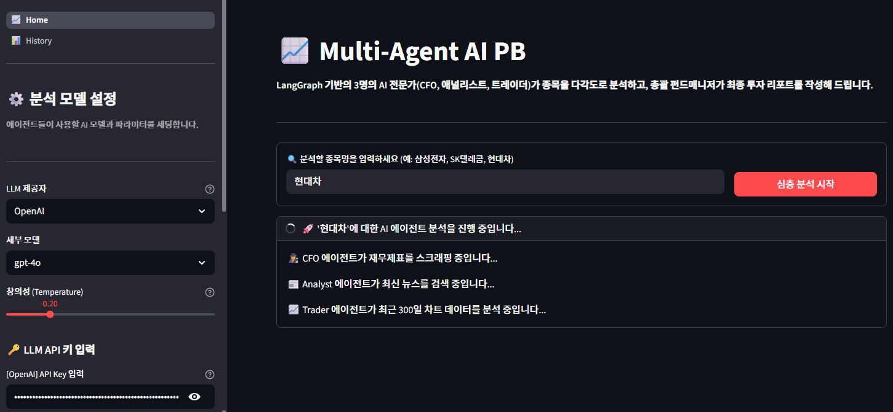
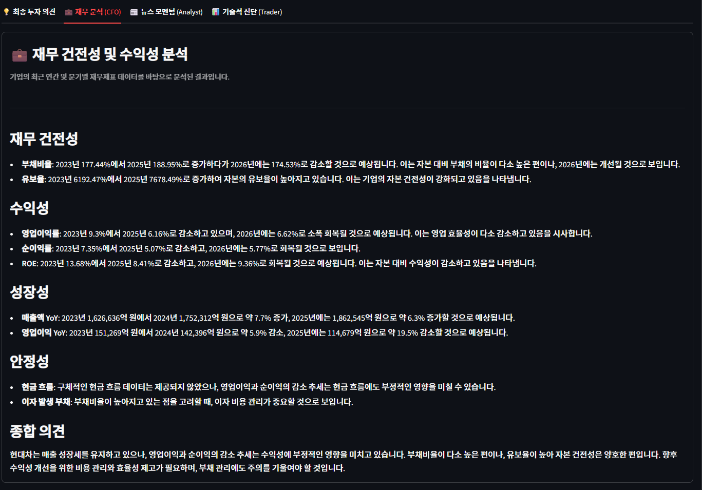
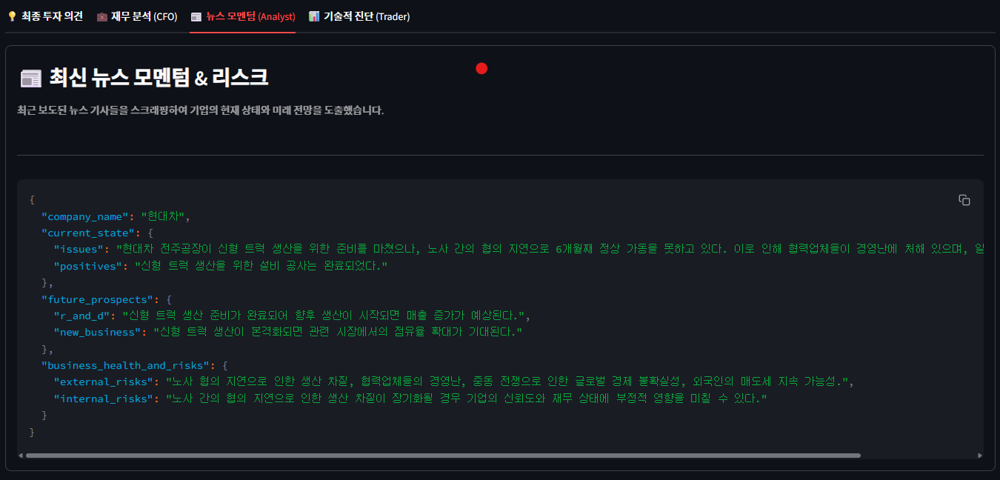
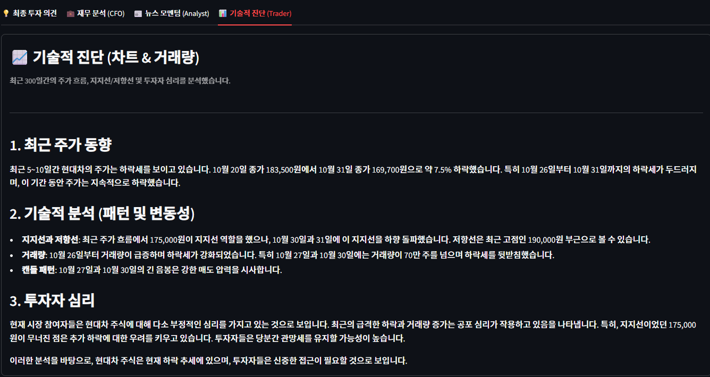
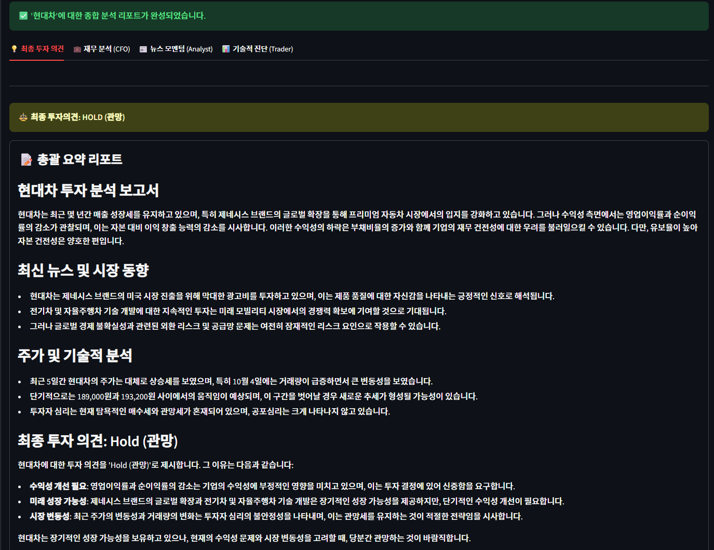
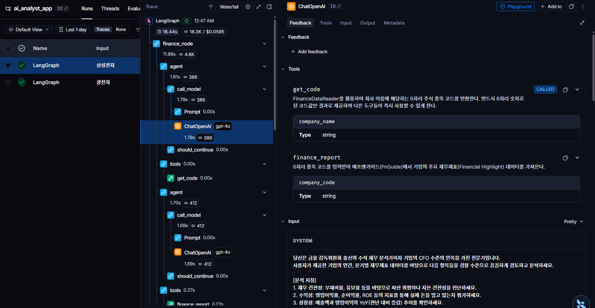
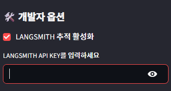
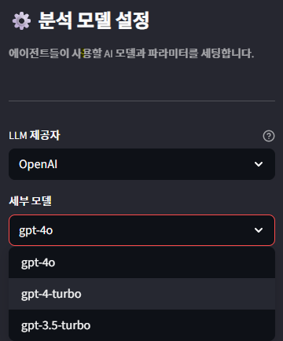

# 📈 Multi-Agent AI PB Project

  📅 문서 버전: 본 README는 2026년 3월 27일 기준으로 작성 및 업데이트되었습니다.

이 프로젝트는 LangGraph와 Multi-Agent 아키텍처를 활용하여 특정 종목에 대해 다각도의 심층 분석을 제공하는 AI 자산관리 서비스입니다.

단순한 데이터 조회를 넘어, 재무(CFO), 뉴스(Analyst), 차트(Trader) 전문가 에이전트가 각각의 도구를 활용해 독립적인 분석을 수행하고, 최종적으로 펀드매니저 에이전트가 이를 취합하여 투자의견 리포트를 작성하는 전문적인 워크플로우를 제공합니다.

백엔드(FastAPI)와 프론트엔드(Streamlit)가 완벽하게 분리된 마이크로서비스 아키텍처(MSA)를 채택하여 확장성과 유지보수성을 극대화하였습니다.



<br>
<br>

# ✔️ Tech Stack (개발 환경)

- **AI & RAG Ecosystem**
  - 
  - 
  - 
  - 
  - 
  - 

- **Backend & Database**
  - 
  - 
  - 
  - 

- **Frontend UI & Data Analysis**
  - 
  - 

- **DevOps & Environment**
  - 
  - 
  - 

<br>
<br>

# 📂 Project Structure

프로젝트의 주요 파일 구성과 역할은 다음과 같습니다.
```
 .
 │
 ├── ⚙️ Backend (API Server)
 │   ├── backend/
 │   │   ├── core/               # 시스템 프롬프트 및 설정값
 │   │   ├── services/           # LangGraph 에이전트 및 분석 도구(Tools) 로직
 │   │   ├── main.py             # FastAPI 엔드포인트 및 DB 연동 (Port 8000)
 │   │   ├── models.py           # 분석 히스토리 저장을 위한 SQLAlchemy 모델
 │   │   ├── database.py         # SQLite 세션 관리
 │   │   └── utils.py            # 공통 유틸리티 함수
 │   └── backend.Dockerfile      # 백엔드 이미지 빌드 명세
 │
 ├── 🖥️ Frontend (UI & Analytics)
 │   ├── frontend/
 │   │   ├── pages/
 │   │   │   └── 1_📊_History.py  # 과거 분석 기록 조회 및 통계 대시보드
 │   │   ├── 0_📈_Home.py         # 메인 분석 실행 및 결과 탭 렌더링 (Port 8501)
 │   │   ├── sidebar.py          # API 키 주입 및 LLM 모델 동적 선택 UI
 │   │   └── ui_components.py    # 결과 리포트용 예쁜 마크다운 렌더링 컴포넌트
 │   └── frontend.Dockerfile     # 프론트엔드 이미지 빌드 명세
 │
 ├── ☸️ Kubernetes & DevOps
 │   ├── k8s/                    # K8s 배포 Manifest (backend, frontend)
 │   └── docker-compose.yml      # 로컬 컨테이너 통합 실행 및 DB 볼륨 매핑
 │
 └── 🛠️ Configuration
     ├── .env                    # API 키 및 환경 변수 보관 (Git 제외)
     ├── ai_analyst.db           # SQLite 로컬 데이터베이스 파일
     └── requirements.txt        # 프로젝트 구동용 파이썬 라이브러리 목록
 ```

 <br>
 <br>

# ✨ Key Features (주요 기능)

- **LangGraph 기반 전문가 협업 시스템 🤝**

  CFO 에이전트: 재무제표를 스크래핑하여 회사의 펀더멘털을 정밀 진단합니다.

  

  Analyst 에이전트: 네이버 뉴스 API와 DuckDuckGo를 활용해 최신 모멘텀을 분석합니다.

  

  Trader 에이전트: 기술적 지표와 차트 데이터를 분석하여 진입 시점을 제안합니다.

  

  Fund Manager 에이전트: 모든 데이터를 취합하여 최종 투자 의견 리포트를 생성합니다.

  

<br>

- **LangSmith 기반 실시간 에이전트 모니터링 및 디버깅 🛠️**

  사고 과정의 투명성 확보: 복잡한 LangGraph 워크플로우 내에서 각 에이전트(CFO, Analyst, Trader 등)가 어떤 도구를 선택하고, 어떤 논리적 단계를 거쳐 결론에 도달하는지 전체 추론 과정을 실시간 트레이싱(Tracing)으로 시각화합니다.

  

  동적 관측성 제어 (On-Off): 서버 코드 수정 없이 프론트엔드 사이드바에서 LangSmith 추적 기능을 즉각적으로 활성화하거나 비활성화할 수 있으며, 사용자별 API 키를 동적으로 주입하여 독립적인 디버깅 환경을 제공합니다.

  

  성능 최적화 및 에러 트래킹: LLM 호출의 지연 시간(Latency), 토큰 소모량, 그리고 도구 호출 시 발생하는 예외 상황을 즉각적으로 파악하여 분석 파이프라인의 안정성을 고도화하고 비용을 효율적으로 관리합니다.

<br>

- **실시간 데이터 수집 및 하이브리드 검색 🔍**

  네이버 검색 API 키 입력 시 고품질의 한국어 뉴스를 우선 탐색하며, 키가 없을 경우 DuckDuckGo로 자동 전환되는 Fallback 시스템을 갖추고 있습니다.

<br>

- **Multi-LLM 동적 스위칭 및 모니터링 🧠**

  프론트엔드에서 GPT-4o, Claude 3.5, Gemini 1.5 Pro 등 최신 모델을 실시간으로 교체하며 분석 품질을 비교할 수 있습니다.

  

  LangSmith 연동을 UI에서 온오프(On-Off) 할 수 있어 에이전트의 사고 과정을 실시간 모니터링 가능합니다.

<br>

- **데이터 보존 및 히스토리 관리 📊**

  SQLite와 SQLAlchemy를 연동하여 모든 분석 결과를 DB에 영구 저장합니다.

  별도의 히스토리 페이지를 통해 과거에 분석했던 종목의 상세 리포트를 언제든 다시 열람할 수 있습니다.

<br>

- **완벽한 컨테이너 인프라 파이프라인 🐳**

  `.dockerignore`를 통한 경량화 빌드와 Docker Compose를 이용한 로컬 테스트 환경을 구축했습니다.

  Kubernetes(Minikube)의 Secret 객체를 활용해 환경 변수 주입 보안을 강화하고, 서비스 간 완벽한 통신 네트워크를 구현했습니다.

<br>
<br>

# 💻 Getting Started (Docker Compose)
  Docker가 설치된 로컬 환경에서 명령어 한 줄로 프론트엔드와 백엔드를 동시에 구동할 수 있습니다.

1. **환경 변수 세팅**
  `.env` 파일을 생성하고 기본 API 키를 입력합니다. (키가 없어도 UI에서 수동 입력이 가능합니다.)

    `코드 Snippet`
    
    ```
    OPENAI_API_KEY=your_key
    # 필요 시 네이버 클라이언트 ID/Secret 등 추가
    ```

<br>

2. **통합 실행 (Build & Run)**

    ```
    docker compose up -d --build
    ```

<br>

3. **접속**

    뷰어 UI (Streamlit): `http://localhost:8501`

    백엔드 API (FastAPI): `http://localhost:8000/docs`

<br>
<br>

# ☸️ Kubernetes (Minikube) Deployment

Minikube를 활용하여 로컬 K8s 클러스터에 서비스를 배포하는 방법입니다.

1. **클러스터 시작 및 이미지 적재**

    ```
    minikube start
    minikube image load ai-analyst-backend:latest
    minikube image load ai-analyst-frontend:latest
    ```

<br>

2. **API 키 Secret 주입 및 배포 적용**

    ```
    kubectl create secret generic ai-analyst-secrets --from-env-file=.env
    kubectl apply -f k8s/backend.yaml
    kubectl apply -f k8s/frontend.yaml
    ```

<br>

3. **서비스 외부 노출 (터널링)**

    ```
    minikube service frontend-service
    ```

    👉 터미널에 출력되는 URL을 브라우저에 입력하여 접속합니다.

<br>
<br>

# 💡 Future Work (향후 개선 계획)

- **기술적 분석(Technical Analysis) 고도화**

  MACD, RSI, 볼린저 밴드 등 다양한 보조 지표를 추가하여 차트 분석의 정밀도를 향상시킬 예정입니다.

<br>

- **실시간 주가 차트 시각화** 

  단순히 텍스트 리포트만 제공하는 것이 아니라, `Plotly` 등을 활용하여 실제 주가 이동평균선과 거래량 차트를 UI에 직접 렌더링할 예정입니다.

<br>

- **포트폴리오 추천 기능**

  분석한 종목들을 기반으로 최적의 투자 비중을 산출해 주는 퀀트 분석 엔진 에이전트를 추가할 계획입니다.
