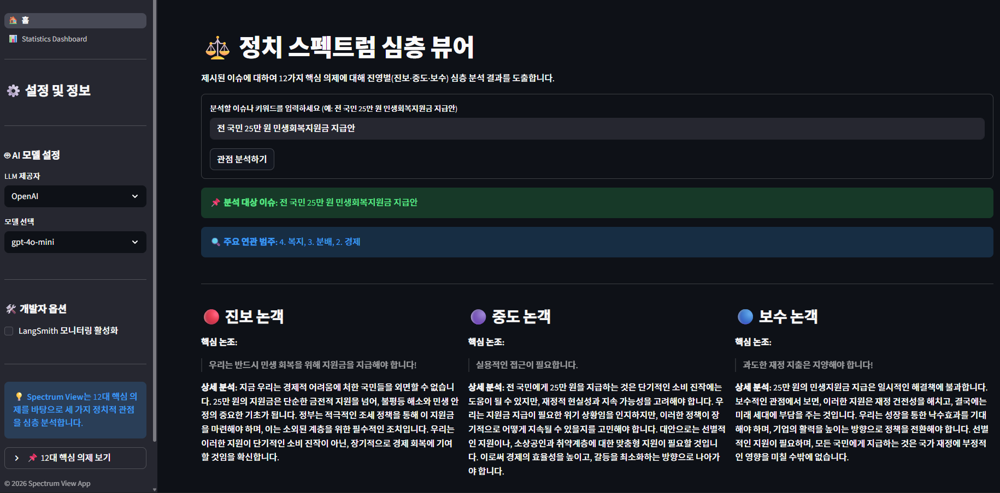

# ⚖️ 정치 스펙트럼 심층 뷰어 (Spectrum View)

  📅 문서 버전: 본 README는 2026년 3월 23일 기준으로 작성 및 업데이트되었습니다.

이 프로젝트는 최신 이슈들에 대해 진보, 중도, 보수 진영이 각각 어떤 논리와 시각으로 접근하는지 심층적으로 풀어내는 AI 서비스입니다.

단순한 프롬프트 엔지니어링을 넘어, LangGraph와 DuckDuckGo 검색을 활용한 RAG(Retrieval-Augmented Generation) 파이프라인을 구축하여 실시간 팩트 기반의 분석을 제공합니다.

백엔드(FastAPI)와 프론트엔드(Streamlit)가 완벽하게 분리된 마이크로서비스 아키텍처(MSA)를 채택하였습니다.



<br>

# ✔️ Tech Stack (개발 환경)

- **AI & RAG Ecosystem**
  - 
  - 
  - 
  - 
  - 

- **Backend & Database**
  - 
  - 
  - 
  - 

- **Frontend UI & Data Analysis**
  - 
  - 

- **DevOps & Environment**
  - 
  - 
  - 

<br>

# 📂 Project Structure

프로젝트의 주요 파일 구성과 역할은 다음과 같습니다.
```
 .
 │
 ├── ⚙️ Backend (API Server)
 │   ├── core/
 │   │   ├── config.py           # LLM 동적 초기화 및 LangSmith 모니터링 설정
 │   │   ├── prompts.py          # 12대 평가 기조가 담긴 시스템 프롬프트 명세
 │   │   └── schemas.py          # Pydantic을 이용한 AI 답변 JSON 규격 정의
 │   ├── services/
 │   │   └── graph.py            # LangGraph 기반 RAG 검색 및 분석 워크플로우 설계
 │   ├── main.py                 # FastAPI 메인 실행 파일 (Port 8000)
 │   ├── database.py             # SQLAlchemy DB 연결 설정
 │   ├── models.py               # SQLite 단일 테이블(AnalysisHistory) 구조 정의
 │   └── utils.py                # 분석 결과 및 RAG 검색 원문 DB 저장 로직
 │
 ├── 🖥️ Frontend (UI & Dashboard)
 │   ├── 0_🏠_홈.py               # Streamlit 메인 화면 (검색창 및 결과 렌더링, Port 8501)
 │   ├── pages/
 │   │   └── 1_📊_Statistics_Dashboard.py  # DB 연동 통계 대시보드 및 시각화
 │   ├── sidebar.py              # LLM 모델 교체 및 LangSmith 토글 UI
 │   └── ui_components.py        # 진영별 3단 컬럼 결과 렌더링 컴포넌트
 │
 ├── ☸️ Kubernetes & Deployment
 │   ├── k8s/                    # K8s 배포 명세서
 │   │   ├── backend.yaml        # 백엔드 Deployment 및 Service (내부망 연동)
 │   │   └── frontend.yaml       # 프론트엔드 Deployment 및 Service (외부 노출)
 │   ├── backend.Dockerfile      # 백엔드 Docker 이미지 빌드 명세
 │   ├── frontend.Dockerfile     # 프론트엔드 Docker 이미지 빌드 명세
 │   └── docker-compose.yml      # 로컬 컨테이너 통합 실행 명세
 │
 ├── 🛠️ Configuration
 │   ├── .env                    # 다중 LLM API 키 및 보안 환경 변수 보관 (Git 제외)
 │   ├── .dockerignore           # Docker 빌드 시 불필요 파일(DB 찌꺼기 등) 제외 목록
 │   └── requirements.txt        # 프로젝트 구동용 파이썬 라이브러리 목록
 ```

 <br>

# ✨ Key Features (주요 기능)

- **LangGraph 기반 RAG 파이프라인 🔍**

  DuckDuckGo 검색 노드(retrieve_node)를 통해 실시간 최신 뉴스 기사를 수집합니다.

  검색된 팩트 데이터(context)를 기반으로 분석 노드(analyze_node)가 할루시네이션(환각) 없는 정확한 평가를 내립니다.

- **12대 핵심 의제에 따른 시스템 ⚖️**

  단순한 찬반 논쟁을 넘어, 진보·중도·보수 3가지 정치적 성향을 대표하는 가상의 패널 3명이 복지, 경제, 안보 등 12가지 핵심 의제를 바탕으로 주어진 이슈를 어떻게 바라보고 해석하는지 입체적인 관점을 제시합니다.

  "100분 토론"과 같은 생동감 있는 구어체 프롬프트를 적용하여 논객의 말투를 사실적으로 구현했습니다.

- **Multi-LLM 동적 스위칭 🧠**

  프론트엔드 사이드바에서 클릭 한 번으로 OpenAI(GPT), Anthropic(Claude), Google(Gemini) 모델을 실시간으로 교체하며 분석 결과를 비교할 수 있습니다.

- **데이터 영속성 및 통계 대시보드 📊**

  모든 분석 기록과 AI가 참고한 뉴스 원문(rag_context)을 SQLite 단일 테이블 아키텍처로 통합 저장하여 검색 추적성을 확보했습니다.

  Pandas를 활용한 대시보드 페이지에서 과거 분석 트렌드를 한눈에 파악할 수 있습니다.

- **완벽한 컨테이너 인프라 파이프라인 🐳**

  `.dockerignore`를 통한 경량화 빌드와 Docker Compose를 이용한 로컬 테스트 환경을 구축했습니다.

  Kubernetes(Minikube)의 Secret 객체를 활용해 환경 변수 주입 보안을 강화하고, 서비스 간 완벽한 통신 네트워크를 구현했습니다.

<br>

# 💻 Getting Started (Docker Compose)
  Docker가 설치된 로컬 환경에서 명령어 한 줄로 프론트엔드와 백엔드를 동시에 구동할 수 있습니다.

1. **환경 변수 세팅**
  최상위 폴더에 `.env` 파일을 생성하고 본인이 구독하고 있는 서비스의 API 키를 입력합니다.

    `코드 Snippet`
    
    ```
    OPENAI_API_KEY = your_openai_key

    ANTHROPIC_API_KEY = your_anthropic_key

    GOOGLE_API_KEY = your_google_key

    LANGCHAIN_API_KEY = your_langsmith_key
    ```

2. **통합 실행 (Build & Run)**

    ```
    docker compose up -d --build
    ```

3. **접속**

    뷰어 UI (Streamlit): `http://localhost:8501`

    백엔드 API (FastAPI): `http://localhost:8000/docs`

<br>

# ☸️ Kubernetes (Minikube) Deployment

Minikube를 활용하여 로컬 K8s 클러스터에 서비스를 배포하는 방법입니다.

1. **클러스터 시작 및 이미지 적재**

    ```
    minikube start
    minikube image load spectrum-backend:latest
    minikube image load spectrum-frontend:latest
    ```

2. **API 키 Secret 주입 및 배포 적용**

    ```
    kubectl create secret generic app-secrets --from-env-file=.env
    kubectl apply -f k8s/backend.yaml
    kubectl apply -f k8s/frontend.yaml
    ```

3. **서비스 외부 노출 (터널링)**

    ```
    minikube service frontend-service
    ```

    👉 터미널에 출력되는 URL을 브라우저에 입력하여 접속합니다.

<br>

# 💡 Future Work (향후 개선 계획)

- **RAG 원문 시각화 UI 추가**

  현재 DB(rag_context)에만 저장되고 있는 실시간 웹 검색 원문을 프론트엔드 화면의 숨김 탭(Expander)으로 노출하여, 사용자가 AI의 분석 근거를 직접 교차 검증할 수 있도록 신뢰도를 극대화할 예정입니다.

- **벡터 DB(Chroma) 연동을 통한 하이브리드 검색**

  단순 웹 검색을 넘어, 기존에 수집된 방대한 정치 평론 데이터를 벡터화하여 하이브리드 RAG 아키텍처로 고도화할 계획입니다.